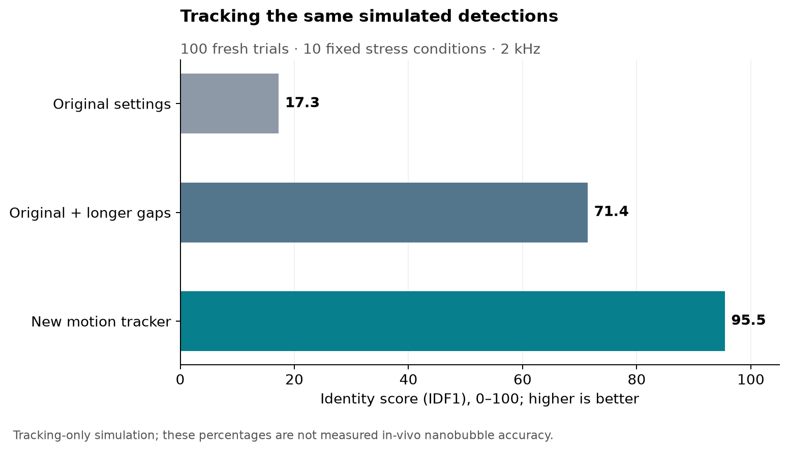
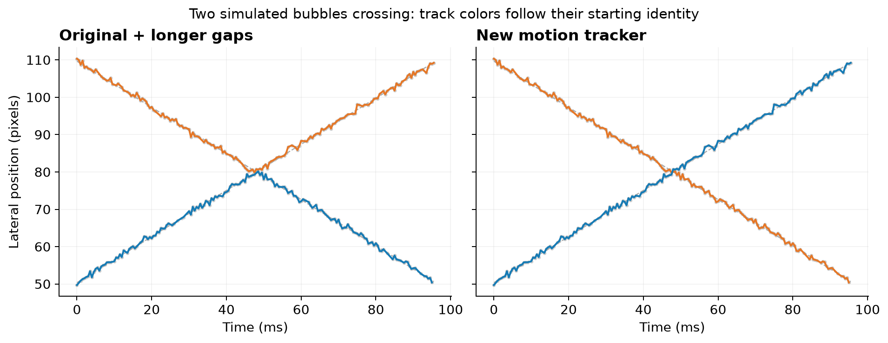

The new tracker improves identity preservation on fixed simulated detection lists. Across the 100 fresh trials in the ten primary stress conditions, its detection-conditioned IDF1 is **95.5/100**, compared with **71.4** for the original tracker given the same gap allowance, and **17.3** for the current original settings.

The improvement over the longer-gap baseline is **24.0 percentage points**, with a paired 95% bootstrap interval of **23.1–24.9 points**. The interval describes repeatability over these simulated trials, not uncertainty in real nanobubble performance. This is an internally frozen holdout experiment, not an externally preregistered study.

The score asks whether the tracker keeps observed detections assigned to the correct bubble identity over time. One global, one-to-one mapping is made between true and output trajectory identities. If IDTP is the number correctly assigned under that mapping, O is the number of true detections supplied to the tracker, and R is the number of output observations, then **IDF1 = 2 × IDTP / (O + R)**. Splitting one bubble into several tracks, swapping identities, dropping observed detections, and retaining false detections lower the score. Missing localizations are excluded from O because localization is held fixed. This is a detection-conditioned use of the [identity-measure framework](https://arxiv.org/abs/1609.01775); it is not a literal percentage of physical bubbles tracked correctly.

All methods receive identical coordinates and retain tracks with at least 16 observed detections. The original uses `simpletracker`, an 8-pixel linking distance and `MaxGapClosing=1`. In this implementation that gap value closes no missed frames. The stronger baseline changes only `MaxGapClosing` to 6, allowing five missing frames. The new tracker also permits five missing nominal frames. Its 8-pixel cap applies around the predicted position; the old cap applies around the last position. Thus this is an algorithm comparison, not identical gate geometry. The old baseline has not undergone an exhaustive parameter optimization.

The changes are structural: a velocity state predicts the next position before Hungarian assignment; covariance represents uncertainty through gaps; explicit unmatched choices avoid forced matches; confirmation and an accumulated spatial likelihood score reject unsupported trajectories. Coordinates are never altered for scoring. Separate smoothed coordinates and physical timestamps are retained for downstream velocity analysis. This is a custom implementation using the existing `munkres.m`; it does not require MATLAB's Sensor Fusion and Tracking Toolbox. Prediction, assignment and track confirmation are established tracking ideas ([MathWorks overview](https://www.mathworks.com/help/fusion/ug/introduction-to-using-the-global-nearest-neighbor-tracker.html)). Motion models have also been studied in [super-resolution ultrasound tracking](https://arxiv.org/abs/2304.00819). The present implementation uses a constant-velocity state with process uncertainty, not that paper's acceleration-state implementation.

The candidate source was frozen before generating 140 new trials: 14 conditions × 10 seeds, each 192 frames (96 ms nominal acquisition duration) at 2 kHz. Ten stress conditions define the primary mean; continuous sparse and random-noise-only scenes are controls, and very short trajectories and persistent false peaks are additional stress controls. Calibration uses 12.32 µm axial and 12.414467 µm lateral pixels. Ordinary simulated speeds are 0.5–5 mm/s; the curved case is approximately 6 mm/s with ±40% pulsatility. Coordinate noise is normally 1 pixel, 2 in the higher-jitter case and 0.5 at crossings. Detections are randomly reordered each frame. The detailed generator and frozen protocol are saved alongside the report.

| Test condition | Original | Original + longer gaps | New tracker |
|---|---:|---:|---:|
| Continuous sparse (control) | 98.2 | 98.2 | 99.4 |
| 20% missed observations | 16.9 | 84.5 | 98.7 |
| 40% missed observations | 1.4 | 73.2 | 87.4 |
| Bursts of 1–5 missing frames | 30.4 | 79.1 | 86.9 |
| Crowded, with missed observations | 17.2 | 53.9 | 96.0 |
| Curved and pulsatile motion | 16.5 | 86.5 | 98.5 |
| Random false detections mixed in | 18.8 | 31.1 | 92.3 |
| Trajectories enter and leave | 18.6 | 88.3 | 99.5 |
| Close opposing crossings | 22.3 | 70.2 | 99.5 |
| Very slow motion | 17.0 | 87.9 | 98.4 |
| Higher coordinate jitter | 13.7 | 59.5 | 97.4 |
| Short trajectories (stress control) | 7.0 | 75.9 | 77.7 |
| Random false detections only (control) | — | 0.0 | — |
| Persistent false peaks (stress control) | 15.3 | 75.9 | 91.1 |

Values are mean identity scores out of 100 across ten trials per row. Undefined IDF1 in an empty scene is shown as —; it is not assigned an artificial perfect score. The primary mean gives equal weight to the ten declared stress conditions. Its 95% interval uses 10,000 paired bootstrap resamples within each fixed condition.

The ablations help separate causes. Disabling motion prediction in the new tracker lowers its primary mean from 95.5 to 81.0. Removing the evidence filter leaves the primary mean near 95.3, but the random-noise-only control then retains an average of 96.8 false tracks per sequence. With that filter, it retains zero in all ten null trials. The longer-gap original retains 56.9 false tracks on average; the original default also retains zero. These controls are why longer trajectories alone are not evidence of better tracking.

The crossing figure shows the first simulated pair in the first crossing seed, chosen by index. Gray dashed lines are truth, gray points are supplied detections, and track colors follow the identity at the first observation. This is an illustrative example; the table includes every seed and pair.

For the real-data workflow check, only the first 128 frames and central image region were used: z=[200,600), x=[256,768) in the saved zero-based 800 × 1024 grid. That yields 29,691 existing L22 2 kHz detections. The saved lists came from the earlier regional-maxima localization run with SVD cutoff 20 and threshold 0.15. No new IQ processing or localization fitting was performed. MATLAB indexing adds 1 to both coordinates without changing their relative positions. The endpoint-interpolated L22 pixel calibration is supplied explicitly; the source used bicubic upsampling.

| Method | Tracks retained | Observations retained | Time (s) |
|---|---:|---:|---:|
| Original settings | 262 | 5637 | 1.47 |
| Original + longer gaps | 579 | 14745 | 1.34 |
| New motion tracker | 277 | 6165 | 1.97 |

These real-data counts are diagnostics, **not accuracy measurements**. More retained tracks may include incorrect links. The subset has no known bubble identities, so it cannot provide an IDF1 or prove improvement in vivo. The runtime includes smoothing for the new tracker and linking for the original; it is an offline subset measurement, not a demonstration of live 2 kHz throughput. No full 2 kHz dataset was processed.

The main remaining limitation is persistent clutter. In the persistent-false-peak test, three stationary artifacts survive all 192 frames. The new tracker retains all 576 false observations per sequence, just like the longer-gap original. Coordinates alone cannot reliably distinguish these from true stationary bubbles. Short trajectories also remain limited by the shared 16-observation rule. Very high jitter can make motion prediction less useful: in exploratory development at 4-pixel jitter, the motion candidate scored below its position-only ablation, though above the original. The default uncertainty estimate can be biased by motion, missed detections and crowding; supply an independently measured localization sigma when available. The spatial evidence score assumes a homogeneous background and is not a calibrated bubble probability. Sudden motion beyond the gate, prolonged gaps, heterogeneous clutter and out-of-plane motion remain unvalidated.

This experiment establishes a better tracking candidate under the specified stress conditions. It does **not** establish 95.5% tracking accuracy for injected 250 nm nanobubbles. The 250 nm diameter and 1:1000 dilution do not uniquely determine per-frame visibility, artifact rates or bubble density in the image. The simulations operate on coordinates with prescribed motion, jitter, dropout and false detections; they are not FIELD II acoustic simulations and do not model nonlinear shell response or infer transmit pressure. A small diffusion term is a scenario assumption, not experimental nanobubble calibration. To measure actual NB tracking accuracy next, use trajectories with independent ground truth, such as a controlled flow phantom or experimentally calibrated signal injection. Multi-frame hypothesis reassessment is a possible further algorithm change, but was not implemented or claimed here.

All eight MATLAB behavioral test groups and the saved-file workflow tests passed. The scorer passed six known-answer tests. Every one of the 700 holdout outputs was audited for valid exclusive assignments, frame order and minimum retained length; new-tracker output coordinates and timestamps were checked against the input detections. The candidate hash matches the frozen protocol, all seven original SRU source hashes remain unchanged, and the real source/subset hashes are unchanged. Detailed measurements are in `holdout_metrics.csv`, `holdout_summary.json`, and `real_subset_diagnostics.csv`.
